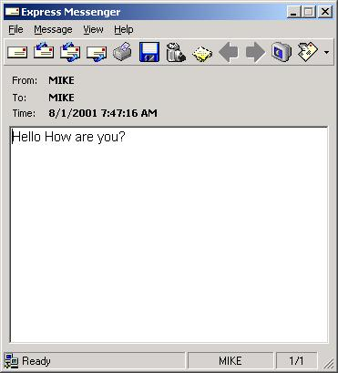



## Express Messenger 2\.0

### Description

Express Messenger is a robust instant message tool. Some of the features are: Application sits in the system tray, popup when new message arrives,sleep mode(blink in tray when message arrives), send messages to users,groups or both,play sounds,etc.. A must see appication. Please vote!!!!
 
### More Info
 

             |
---                |---
**Submitted On**   |2001-11-30 10:57:36
**By**             |[Mike Kempf](https://github.com/Planet-Source-Code/PSCIndex/blob/master/ByAuthor/mike-kempf.md)
**Level**          |Advanced
**User Rating**    |4.7 (42 globes from 9 users)
**Compatibility**  |VB 6\.0
**Category**       |[Complete Applications](https://github.com/Planet-Source-Code/PSCIndex/blob/master/ByCategory/complete-applications__1-27.md)
**World**          |[Visual Basic](https://github.com/Planet-Source-Code/PSCIndex/blob/master/ByWorld/visual-basic.md)
**Archive File**   |[Express\_Me391301232001\.zip](https://github.com/Planet-Source-Code/mike-kempf-express-messenger-2-0__1-25730/archive/master.zip)

